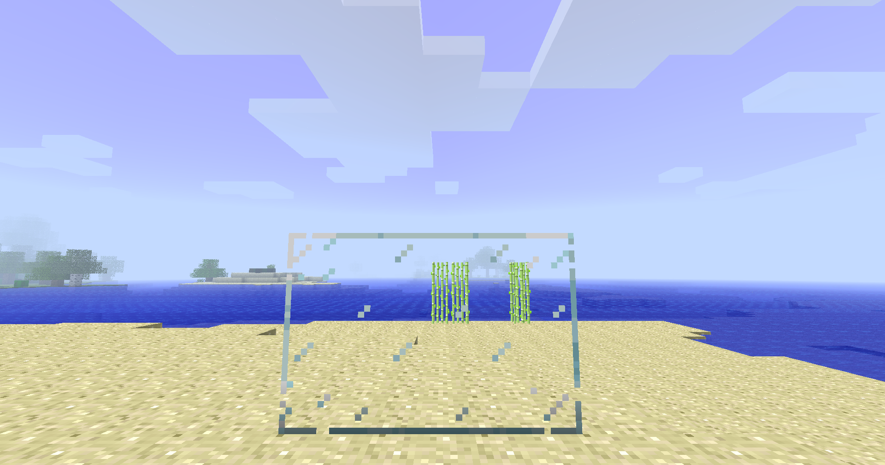
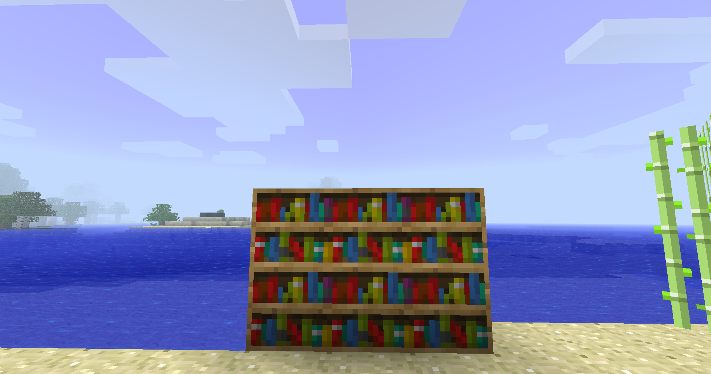

# ConnectedTextureMod Beta

ConnectedTexturesMod is a b1.7.3 [StationAPI](https://github.com/ModificationStation/StationAPI) mod that adds support for chisels custom texture system.

## Features

- Support for CTM's many texture types
- Support for CTM's json overrides

## Usage
check out CTM's wiki for available texture types [here](https://github.com/Chisel-Team/ConnectedTexturesMod/wiki)

## Requirements
[StationAPI](https://github.com/ModificationStation/StationAPI)  
[GCAPI](https://modrinth.com/mod/glass-config-api)  
[ModMenu](https://github.com/calmilamsy/ModMenu)

# Screenshots
Example of a block with ctm texturetype

Example of a block with ctm horizontal texturetype

# Credits
I took code from both the 1.13 version of ConnectedTexturesMod and the 1.19 fabric port. more information can be found in [CREDITS](CREDITS)
